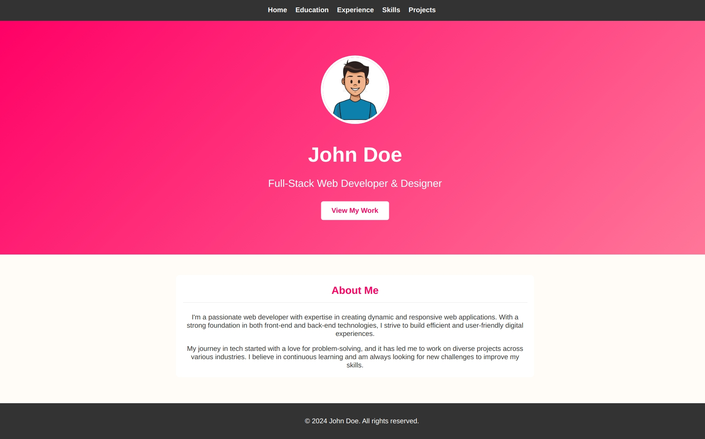

# AWS S3 Bucket Static Website
<div align="center">
  
  <p align="center">Home Page</p>
</div>

## Steps to deploy Application
1. Create AWS [IAM User](https://docs.aws.amazon.com/IAM/latest/UserGuide/id_users_create.html#id_users_create_console)
2. Set necessory permision to create and destroy S3 resources (Eg: **AmazonS3FullAccess** or **AdministratorAccess**)<br>
    > use Permissions --> Add permissions --> Attach policies directly
3. Install [AWS CLI](https://docs.aws.amazon.com/cli/latest/userguide/getting-started-install.html)
4. Configure AWS [IAM User in AWS CLI](https://docs.aws.amazon.com/cli/latest/reference/configure/)<br>
    ```
    $ aws configure
    AWS Access Key ID [None]: <accesskey>
    AWS Secret Access Key [None]: <secretkey>
    Default region name [None]: <default-region> eg: us-east-1
    Default output format [None]: json
    ```
    > Check user is configured correctly<br>`$ aws iam list-users`
5. Install [Terraform](https://developer.hashicorp.com/terraform/tutorials/aws-get-started/install-cli)
6. Initialize the project <br>
    `$ terraform init`
7. Update bucket name in `variables.tf` (bucketname should be globally unique)
8. Deploy the project<br>
    `$ terraform apply -auto-approve`<br>
    
    > Outputs:<br>
    websiteendpoint = "terraforms3staticwebsite.s3-website-us-east-1.amazonaws.com"
9. Open the browser and enter the website endpoint in address bar (Eg: `terraforms3staticwebsite.s3-website-us-east-1.amazonaws.com`)
10. Destroy the project<br>
    `$ terraform destroy -auto-approve`

    **Check everything is cleaned up and destroyed**

For more information follow the [Terraform official documentation](https://registry.terraform.io/providers/hashicorp/aws/latest/docs)